# VLM Architecture Reference

This document compares every vision-language model (VLM) path in Halo-VLM and provides UML structural and class diagrams in [Mermaid](https://mermaid.js.org/) format.

---

## Table of Contents

1. [At a Glance](#1-at-a-glance)
2. [Model Comparison](#2-model-comparison)
3. [Package Structure (UML Component)](#3-package-structure-uml-component)
4. [HaleVLM — Class Diagram](#4-halevlm--class-diagram)
5. [Legacy Halo-VLM — Class Diagrams](#5-legacy-halo-vlm--class-diagrams)
6. [Data Pipeline — Class Diagram](#6-data-pipeline--class-diagram)
7. [Forward-Pass Sequence Diagrams](#7-forward-pass-sequence-diagrams)
8. [Config → Target Mapping](#8-config--target-mapping)
9. [Entry Points](#9-entry-points)
10. [Unified Package (Post-Merge)](#10-unified-package-post-merge)

---

## 1. At a Glance

Halo-VLM ships **three model architectures** and **two data registries** that reuse the same `HaleVLM` model:

| Name | Package | Type | Role |
|------|---------|------|------|
| **HaleVLM** | `hale_vlm` | Production model | Pretrained SigLIP/CLIP + projector + Qwen3 / DeepSeek-R1 LLM |
| **BasicVLM** | `hale_vlm.models.scratch` | Scratch model | OpenCLIP global feature + PyTorch `TransformerDecoder` |
| **HaloVLM** | `hale_vlm.models.scratch` | Scratch model | Custom ViT + MoE decoder transformer |
| **SmolVLM registry** | `hale_vlm.data` | Data catalog | 19 HF multimodal datasets (vision / video / context stages) |
| **SmolVLA registry** | `hale_vlm.data` | Data catalog | Robotics demonstration datasets (community / sim / real) |
| **Robotics VLM adapter** | `hale_vlm.data` | Data converter | Maps `VLASample` → `VLMSample` with mode-specific prompts |

> **Important:** Configs named `smolvlm_*` and `smolvla_*` select **training data**, not a separate model class. Scratch models use configs such as `halo_moe_coco.yaml`, `basic_vlm_coco.yaml`, or `halo_moe_overfit.yaml`.

---

## 10. Unified Package (Post-Merge)

All VLM code paths now route through **`hale_vlm`**:

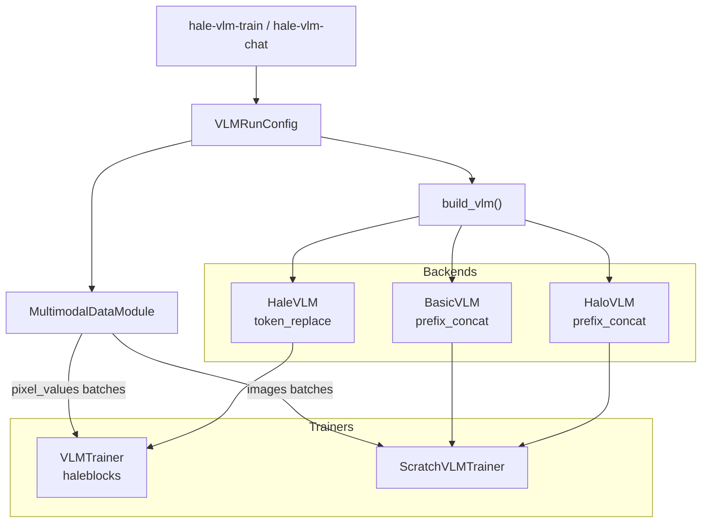

| Config | Model | Data source | Trainer |
|--------|-------|-------------|---------|
| `base.yaml` | HaleVLM | overfit / registry | `VLMTrainer` |
| `halo_moe_coco.yaml` | HaloVLM | `coco_lavis` | `ScratchVLMTrainer` |
| `halo_moe_overfit.yaml` | HaloVLM | overfit | `ScratchVLMTrainer` |
| `smolvlm_*.yaml` | HaleVLM | SmolVLM registry | `VLMTrainer` |

All training and inference run through **`hale-vlm-train`** and **`hale-vlm-chat`** with local plugin registries under `hale_vlm/registry/`.

---

## 2. Model Comparison

### 2.1 Architecture

| Dimension | HaleVLM | BasicVLM | HaloVLM |
|-----------|---------|----------|---------|
| **Philosophy** | Assemble pretrained HF components | Train small stack from scratch | Custom ViT + MoE decoder research stack |
| **Vision encoder** | SigLIP / CLIP / AutoModel (HF) | OpenCLIP ViT-B-32 | Custom `VisTransformer` (6 layers) |
| **Language model** | Qwen3-8B or DeepSeek-R1-Qwen-7B | 12-layer PyTorch `TransformerDecoder` | 16-layer `DecoderTransformer` with MoE |
| **Projector** | `VisionProjector` (linear or 2-layer MLP) | `ImageProjector` (3-layer MLP) | `ImageProjector` (3-layer MLP) |
| **Image fusion** | In-place `<image>` token replacement | Prefix: 1 global image token | Prefix: 196 patch tokens (14×14) |
| **Positional encoding** | Inside pretrained LLM | Sinusoidal (fixed) | Learned `nn.Embedding` |
| **Loss** | HF causal LM (`labels` → `outputs.loss`) | Manual cross-entropy; image positions masked | Same as BasicVLM |
| **Fine-tuning** | LoRA on LLM; optional vision unfreeze | Full-model AdamW | Full-model AdamW |
| **Training infra** | `hale-vlm-train`, YAML configs, `VLMTrainer` | `halo_vlm.train.BasicVLMTrainer` | Same trainer path as BasicVLM |
| **Inference** | `hale-vlm-chat` → `model.generate()` | `halo_vlm.inference.VLMInference` | Same inference path as BasicVLM |

### 2.2 Image Fusion Strategies

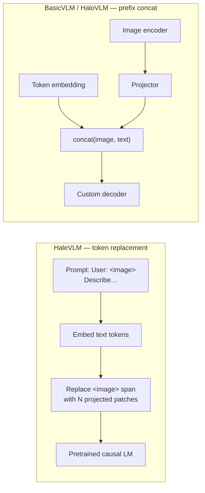

### 2.3 Registered Variants (HaleVLM only)

| Registry name | LLM backbone | Config file |
|---------------|--------------|-------------|
| `qwen3_8b_vlm` | `Qwen/Qwen3-8B` | `configs/base.yaml`, `configs/qwen3_8b_overfit.yaml` |
| `deepseek_r1_qwen_7b_vlm` | `deepseek-ai/DeepSeek-R1-Distill-Qwen-7B` | `configs/deepseek_r1_qwen_7b.yaml` |

Both variants share the same `HaleVLM` class; only the LLM preset and `reasoning_mode` flag differ.

---

## 3. Package Structure (UML Component)

High-level module layout and dependencies.

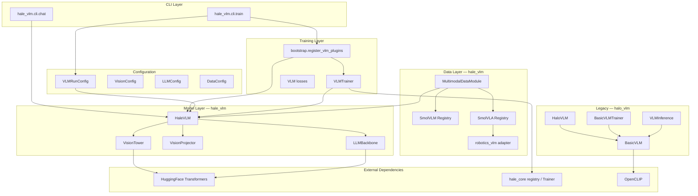

### Repository layout

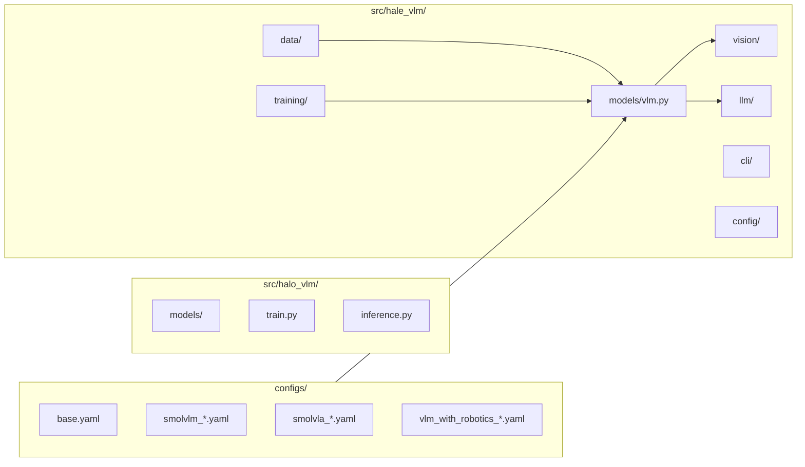

---

## 4. HaleVLM — Class Diagram

Production VLM assembled from pretrained vision and language components.

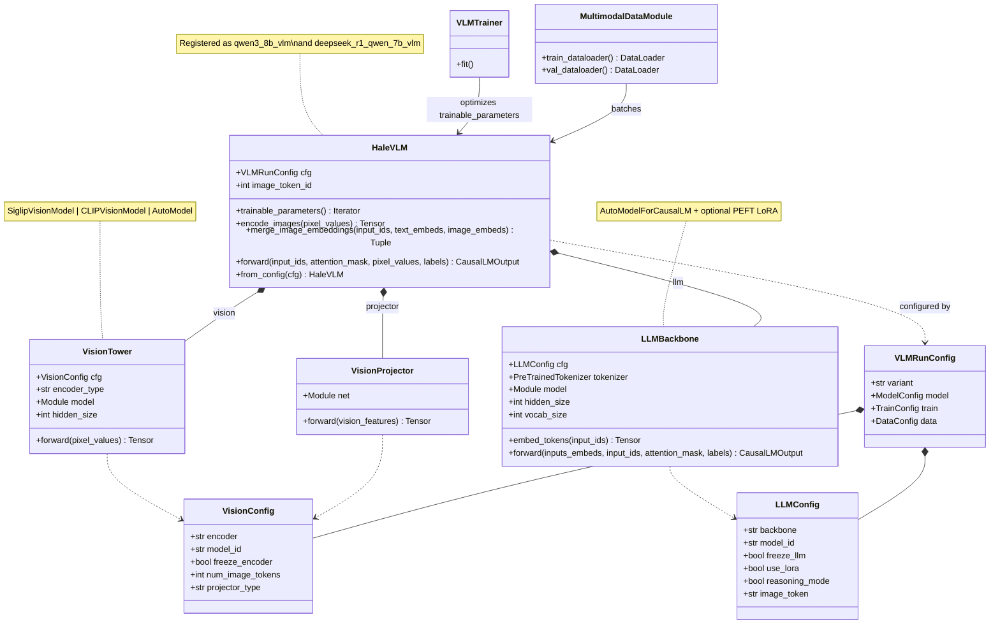

### HaleVLM factory and registry

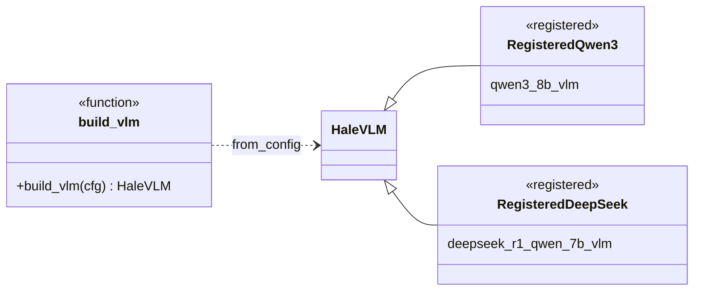

---

## 5. Legacy Halo-VLM — Class Diagrams

### 5.1 BasicVLM

OpenCLIP produces a **single global image token** prepended to the text sequence.

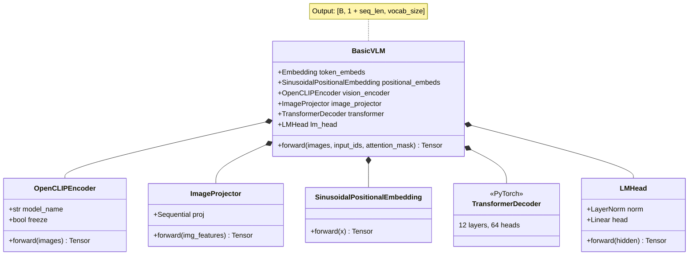

### 5.2 HaloVLM

Custom ViT emits **196 patch tokens**; decoder blocks use **Mixture-of-Experts** FFN.

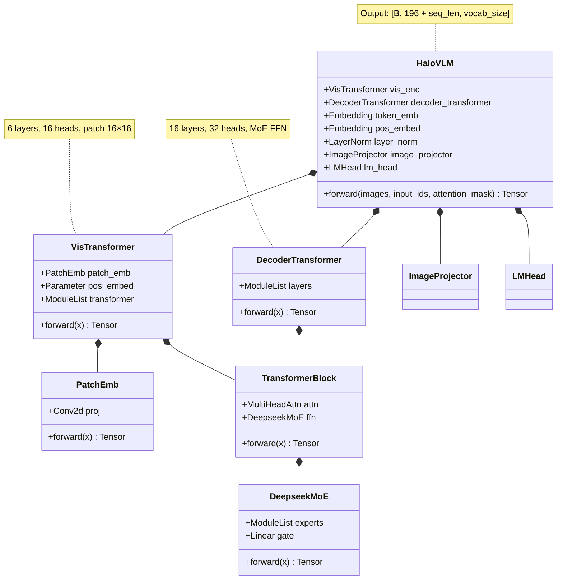

### 5.3 Shared legacy components

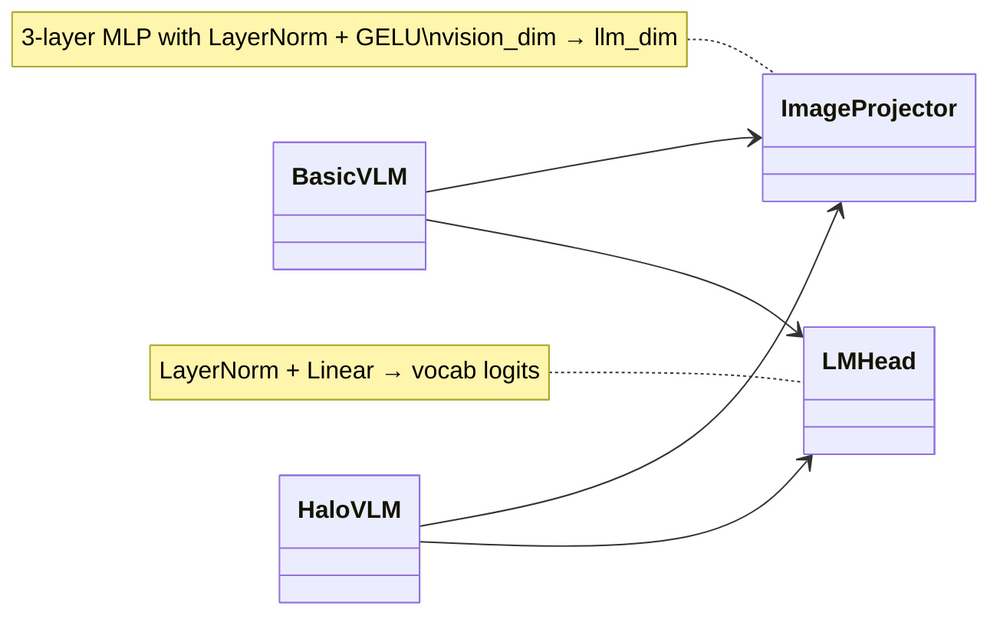

---

## 6. Data Pipeline — Class Diagram

SmolVLM, SmolVLA, and robotics modes are **data paths** into the same `HaleVLM` training loop.

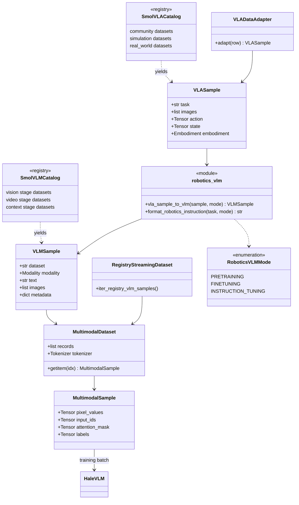

### Robotics prompt modes

| Mode | Prompt template | Typical use |
|------|-----------------|-------------|
| `pretraining` | `Robot task: {task}` | `vlm_with_robotics_pretrain.yaml` |
| `finetuning` | `Execute the following manipulation task: {task}` | `vlm_with_robotics_finetune.yaml` |
| `instruction_tuning` | `Instruction: {task}\nDescribe the robot action…` | Custom / eval prompts |

---

## 7. Forward-Pass Sequence Diagrams

### 7.1 HaleVLM

```mermaid
sequenceDiagram
    autonumber
    participant DL as DataLoader
    participant V as VisionTower
    participant P as VisionProjector
    participant L as LLMBackbone
    participant M as HaleVLM.merge_image_embeddings

    DL->>L: input_ids, attention_mask, labels
    DL->>V: pixel_values [B,3,H,W]
    V->>V: SigLIP / CLIP forward
    V-->>P: patch features [B, N, D_v]
    P-->>M: projected [B, N, D_llm]
    L->>L: embed_tokens(input_ids)
    L-->>M: text_embeds [B, seq, D_llm]
    M->>M: replace &lt;image&gt; token span
    M-->>L: inputs_embeds, attention_mask
    L->>L: causal LM forward (+ LoRA)
    L-->>DL: loss, logits
```

### 7.2 BasicVLM

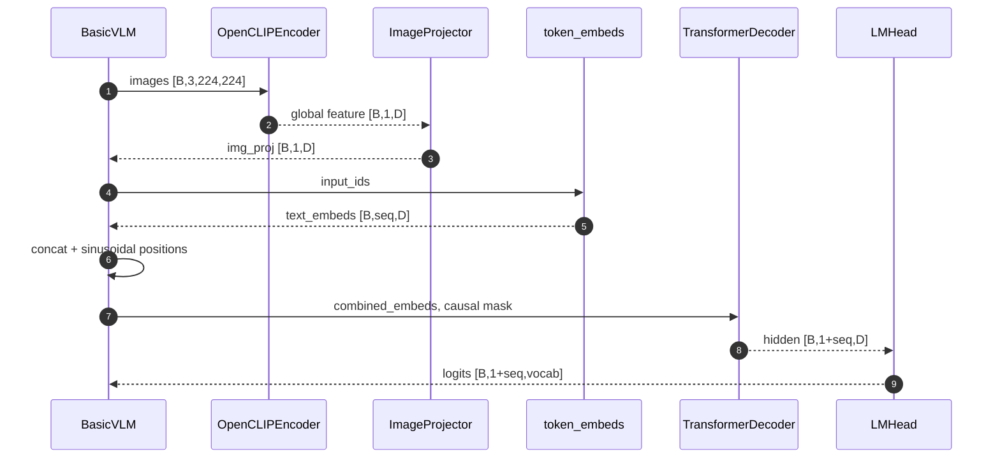

### 7.3 HaloVLM

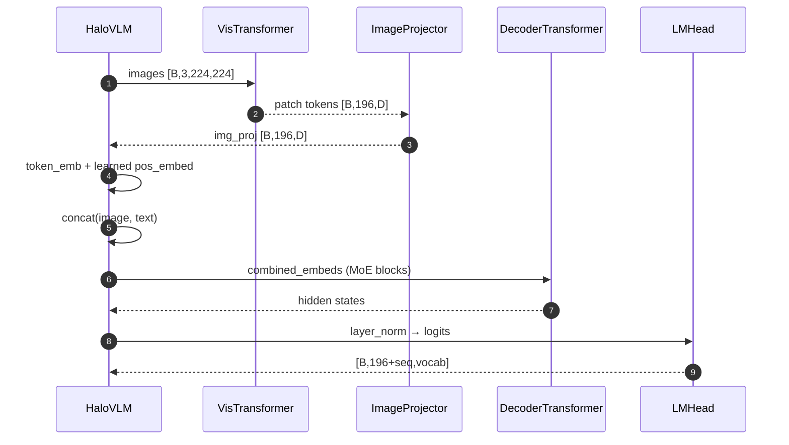

---

## 8. Config → Target Mapping

All configs live in `configs/` and drive **HaleVLM** training unless noted.

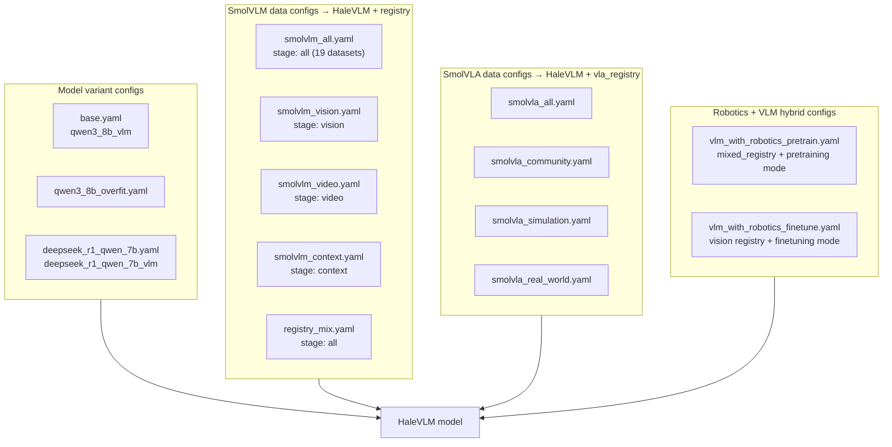

| Config | Model variant | Data source | Notes |
|--------|---------------|-------------|-------|
| `base.yaml` | `qwen3_8b_vlm` | `overfit` | Default local smoke config |
| `qwen3_8b_overfit.yaml` | `qwen3_8b_vlm` | `overfit` | Alias of base |
| `deepseek_r1_qwen_7b.yaml` | `deepseek_r1_qwen_7b_vlm` | inherits base data | `reasoning_mode: true` |
| `smolvlm_all.yaml` | inherits base | `registry` / `all` | Full SmolVLM mix |
| `smolvlm_vision.yaml` | inherits base | `registry` / `vision` | Image-heavy datasets |
| `smolvlm_video.yaml` | inherits base | `registry` / `video` | Video datasets |
| `smolvlm_context.yaml` | inherits base | `registry` / `context` | Long-context text |
| `registry_mix.yaml` | inherits base | `registry` / `all` | Same as `smolvlm_all` |
| `smolvla_all.yaml` | inherits base | `vla_registry` / `all` | All robotics stages |
| `smolvla_community.yaml` | inherits base | `vla_registry` / `community` | Community SO-100 HF sets |
| `smolvla_simulation.yaml` | inherits base | `vla_registry` / `simulation` | LIBERO, MetaWorld |
| `smolvla_real_world.yaml` | inherits base | `vla_registry` / `real_world` | Real robot SO-100/101 |
| `vlm_with_robotics_pretrain.yaml` | inherits base | `mixed_registry` | SmolVLM all + robotics pretrain prompts |
| `vlm_with_robotics_finetune.yaml` | inherits base | `registry` + robotics | Vision stage + finetune prompts |

---

## 9. Entry Points

| Stack | Train | Chat / Infer |
|-------|-------|--------------|
| **hale_vlm** | `uv run hale-vlm-train configs/<name>.yaml` | `uv run hale-vlm-chat configs/base.yaml --image <path>` |
| **halo_vlm** | `PYTHONPATH=src uv run python -m halo_vlm.train` | `PYTHONPATH=src uv run python -m halo_vlm.inference --model <ckpt> --image <path>` |

Plugin registration (`hale_vlm.bootstrap.register_vlm_plugins`) wires:

- **Config:** `VLMRunConfig`
- **Models:** `qwen3_8b_vlm`, `deepseek_r1_qwen_7b_vlm`
- **Trainer:** `vlm` → `VLMTrainer` (optimizer sees only `trainable_parameters()`)
- **Loss:** per-variant handlers delegating to HF `outputs.loss`

---

## Related Docs

- [`dataloader.md`](./dataloader.md) — legacy COCO dataloader notes
- [`halo_notes.md`](./halo_notes.md) — research reading list and fusion taxonomy
